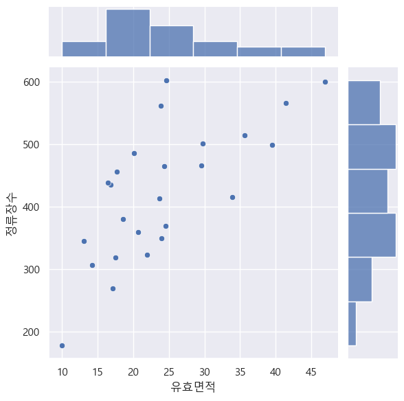

# 서울시 생활 정보 기반 대중 교통 수요 분석

### 1️⃣ 미션 : 버스 노선 추가가 필요한 서울시 내 자치구 선정<br/><br/>

### 2️⃣ 데이터 : 생활이동 정보 등의 Tabular 데이터, csv 파일로 제공 (출처: 서울시 공공데이터 포털)
    1) 서울시 구별 버스 승하차 이용 데이터 / 서울시 버스 데이터
    2) 서울시 구별 생활 인구 데이터
    3) 서울시 구별 주민 등록 인구 데이터
    4) 서울시 구별 업종 등록 데이터
  
### 3️⃣ 목표 
    1) 새로운 도메인의 데이터를 파악한 후 적절히 처리하여 분석에 필요한 형태로 정리한다.
    2) 가설 수립, 단변량 분석, 이변량 분석, 가설 검증 등을 통해 비즈니스 인사이트를 도출한다

### 4️⃣ 목차

1. [**구별 버스정류장 분석**](#bus)

2. [**구별 이동인구 분석**](#move)

3. [**구별 등록인구 분석**](#registration)

4. [**구별 업종 분석**](#industry)

5. [**최종 데이터 분석**](#final)

<br /><br />

<div id="bus"> 
 
  ## 🚌 구별 버스정류장 분석 (1. 구별 버스정류장 분석.ipynb)

  >1 ) "서울시" 데이터만 추출, 결측치, 데이터프레임 합치기 등 가공 후 csv 파일로 저장한다. 
  <br/>2 ) 버스정류장 데이터를 활용하여 서울시 내 각 구별 정류장 수, 노선 수, 승하차 고객수를 분석한다.
  
  ```
  💡 분석 결과

    위 차트를 통해 알게된 사실을 정리해봅시다.
    1) 노선개수가 증가할수록 승차/하차평균승객수가 증가하는 경향이 있다.(중간정도 관계)
    2) 노선개수가 증가할수록 승차/하차총승객수가 증가하는 경향이 있다. (높은 관계)
    3) 정류장개수와 승차/하차평균승객수는 관계가 없다고 볼 수 있음 다만! 승차/하차총승객수와는 관련 있음 (높음)
  ```
  <br/>

  <div align="left">
    
      
  </div>

  <br/>
</div><br />

<div id="move"> 
 
  ## 🧑‍🤝‍🧑 구별 이동인구 분석 (2. 구별 이동인구 분석.ipynb)

  >서울시 생활이동 정보 데이터의 정보 확인 및 전처리 과정을 거쳐 필요한 데이터만 추출하여 저장한다.
  
  ```
  💡 분석 결과
    1) 유출이 제일 많은 구는? 강남구
    2) 유입이 제일 많은 구는? 강남구
    3) 유출이 제일 적은 구는? 금천구
    4) 유입이 제일 적은 구는? 금천구
  ```
  <br/>

  <br/>
</div><br />

<div id="registration"> 
 
  ## 🧑‍🤝‍🧑 구별 등록인구 분석 (3. 구별 업종 분석.ipynb)

  >서울시 내 각 구별로 등록된 인구 데이터의 정보 확인 및 전처리 과정을 거쳐 필요한 데이터만 추출하여 저장한다.
  <br/>자치구, 총 인구 수(계), 남자, 여자, 세대당 인구, 65세이상 고령자 컬럼을 추출했다.

  <br/>
</div><br />

<div id="industry"> 
 
  ## 🧑🏻‍🏭 구별 업종 분석 (4. 구별 업종 분석.ipynb)

  >서울시 내 각 구 별로 등록업종을 분석하고 필요한 데이터만 추출하여 저장한다.
  <br/>한식일반음식업 종사자수, 커피전문점 종사자수, 기타주점업 종사자수, 일반교과학원 종사자수, 한식육류요리전문점 종사자수 컬럼을 추출했다.
  
  <br/>
</div><br />

<div id="final"> 
 
  ## ✍🏻 최종 데이터 분석 (5. 데이터 분석.ipynb)

  >1 ) 지금까지 1~4에서 준비한 데이터 파일을 합친다. 
  <br/>2 ) 합쳐진 데이터프레임을 기반으로 데이터 분석을 진행한다.
  <br/>3 ) 최종적으로 버스정류장 개설이 필요한 자치구를 선정한다.
  
  ```
  💡 가설 수립

    1) 유효 면적과 정류장 수가 관련이 있을 것이다.​ - 유효면적: 자치구별 면적에서 실제로 생활할 수 있는 부분의 면적​ => 면적의 영향을 제외하고 계산하기 위해 가설 2~5의 feature에서 유효면적을 나눈다.

    2) 인구밀도별 택시 종사자 수와 정류장 수가 관련이 있을 것이다.​

    3) 인구밀도별 사업체 수와 정류장 수가 관련이 있을 것이다.​ - 택시 종사자, 운송업, 도매업 제외​

    4) 버스 수와 정류장 수가 관련이 있을 것이다.​ - 버스 수 = 승차총승객수/승차평균승객수​
    
    5) 65세이상고령자 수와 정류장 수가 관련이 있을 것이다.​
  ```
  <br/>

  <div align="left">
    <p>가설 1</p>
    
      
  </div>

  <br/>
</div><br />
